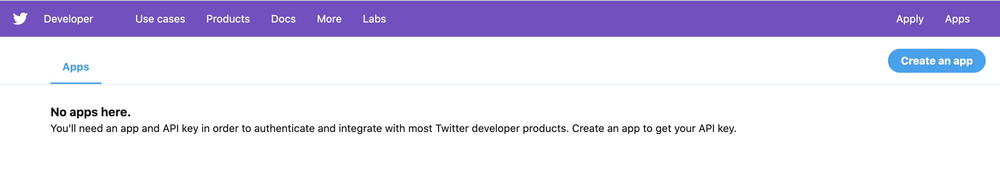
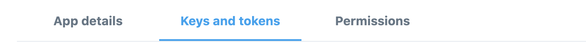
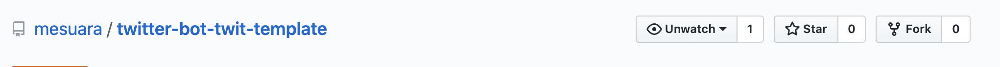

# twitter-bot-twit-template
 This is a template created using [Twit](https://github.com/ttezel/twit). It searches for tweets based on the word passed and then retweets those tweets.

 ## Installing

 * [Get Twitter tokens](https://github.com/git/git/blob/master/README#L1)
 * [Install the template](https://github.com/git/git/blob/master/README#L20)


## Get Twitter Tokens

* You will need a [twitter developer account](https://developer.twitter.com/en/apps) to create an App so you can get the tokens and keys. 
* Once you get approved go to [link](https://developer.twitter.com/en/apps), click on the create an app

* Fill in the fields. For the `Website URL` you can just put `https://www.example.com`.
* Click on the app that was created and navigate to Keys and Tokens.

* If there isn't a Access token & access token secret generate one and save the information in a file/note.

### Next:

- Fork this repo

- Open terminal, navigate to the folder you want to have the project saved. Run the command below:
 ```shell
    git clone https://github.com/mesuara/twitter-bot-twit-template
 ```
- Open the folder in a code editor. 
- Make sure you have node. If you're not sure run the command below to check. You can download node [here](https://nodejs.org/en/download/) if you don't have it. You will need it to run the bot file
```shell
node -v
```
- Make sure you're in the that folder on the Terminal and run:
```shell
npm i
```
- On the `index.js` file paste in the saved tokens and keys from twitter. That's how you give Twitter and Twit access to your account. All the API calls to Twitter are made through Twit library.Check out [Twit](https://github.com/ttezel/twit) to see how it works.
```shell
let T = new Twit({
    consumer_key: 'your API key goes here',
    consumer_secret: 'your API secret key goes here',
    access_token: 'your access token goes here',
    access_token_secret:'your access token secret goes here' ,
})
```
- The code lines 16-18  on `index.js` it's just to post a tweet so you test if your bot is working. 
    - By default the tweet will just say "Hello World" if you would like to change it just change `status` string
```shell
 T.post('statuses/update', { status: 'change this string to what you would like to tweet instead' }, function(err, data, response) {
     console.log(data)
  })
```

- Uncomment the lines 16-18 save and run on the terminal:
```shell
node index.js
```
-
